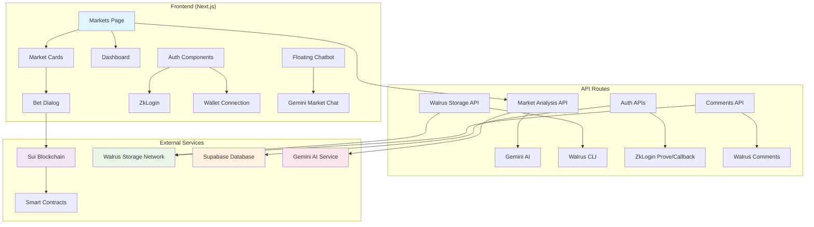
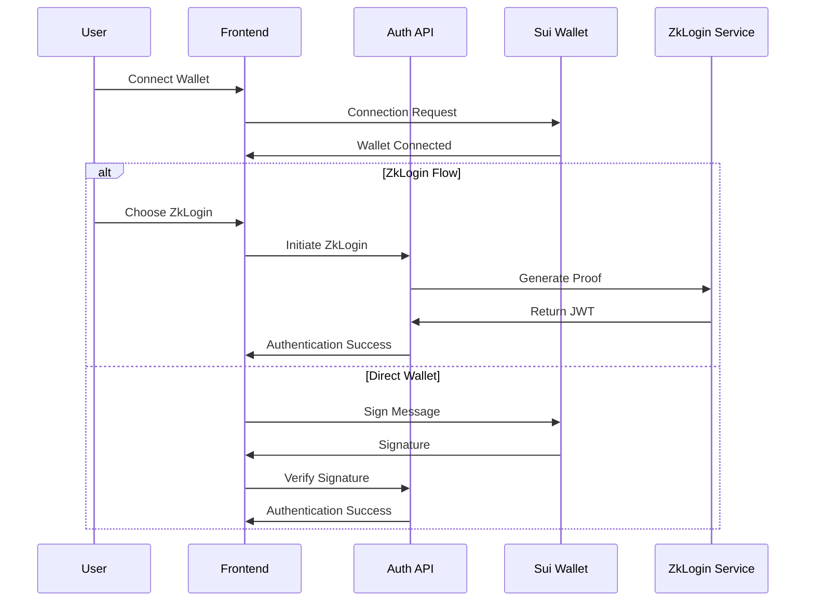
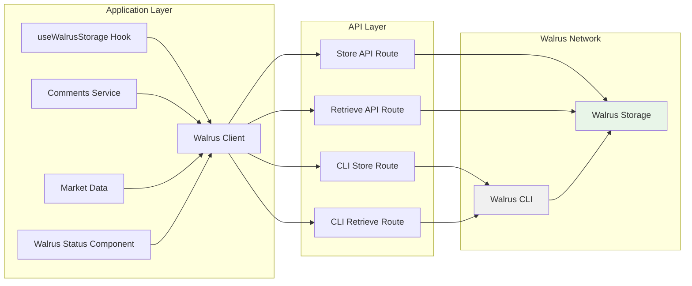
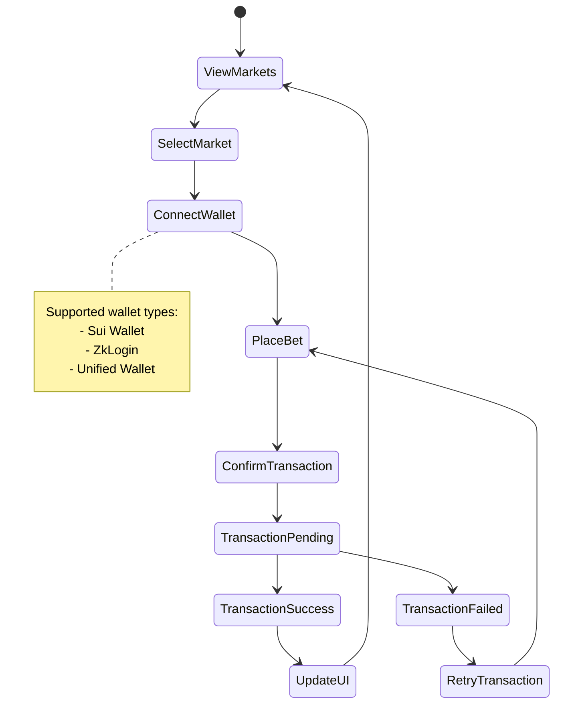
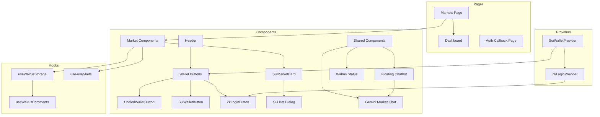
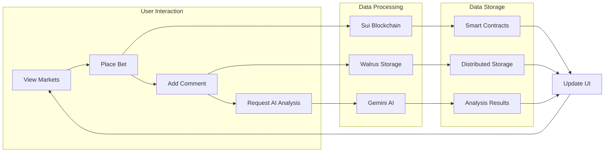
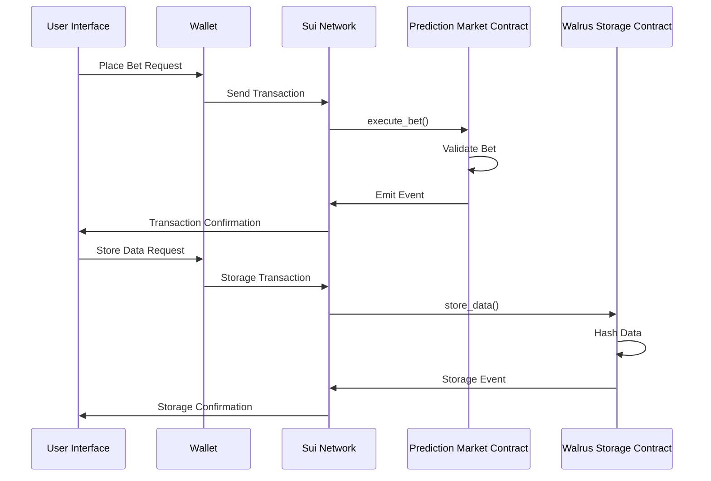
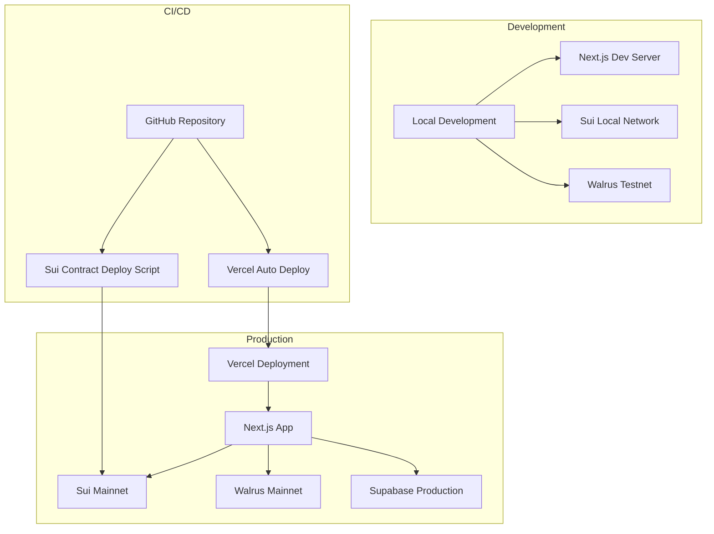

# System Architecture and Flow Diagrams

This document visualizes the project's system architecture, data flows, and component relationships using Mermaid diagrams.

## 1. Overall System Architecture

## 2. Authentication Flow

## 3. Walrus Storage Integration

## 4. Market Betting Flow

## 5. Component Relationships

## 6. Data Flow

## 7. Smart Contract Interaction

## 8. Deployment Architecture

## Notes

- **Sui Blockchain**: Main blockchain network where smart contracts run
- **Walrus Storage**: Distributed storage network for large data
- **ZkLogin**: Privacy-focused authentication system
- **Gemini AI**: AI service for market analysis and chatbot
- **Vercel**: Frontend hosting and deployment platform

These diagrams are designed to help understand the project's complex structure and facilitate new developers' adaptation to the system.