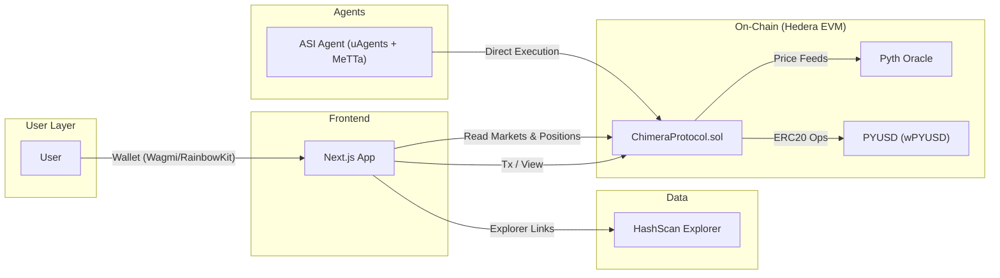
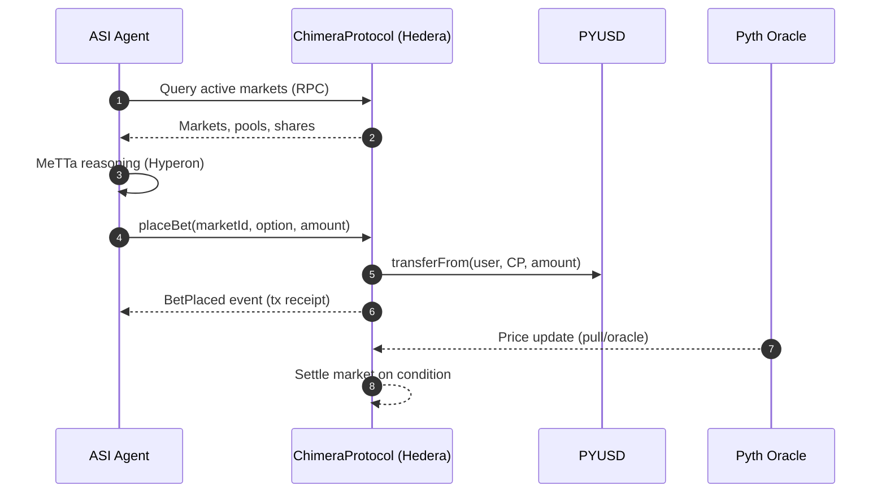

# System Diagrams

## High-Level Architecture

## Headless Execution Sequence

## Components
- Frontend: `Next.js` app (headless optional)
- ASI Agent: uAgents + MeTTa (Hyperon) with fallback

- On-Chain: `ChimeraProtocol.sol`, Pyth Oracle, PYUSD (wPYUSD)
- Observability: HashScan Explorer
